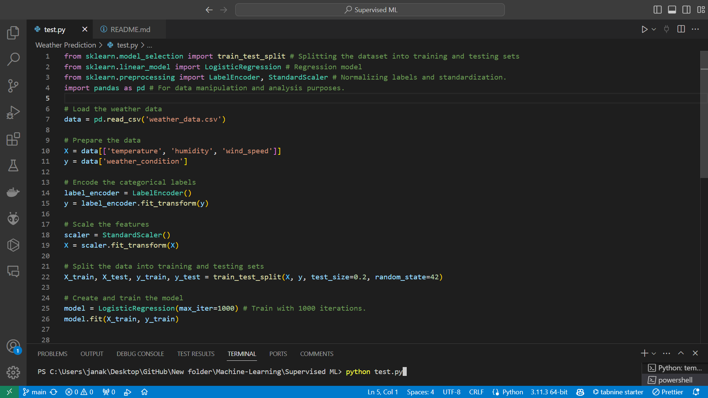

# Weather Prediction

[](LICENSE)

## Description

This python script is a simple implementation of a Logistic Regression model to predict weather conditions(n = 4) based on temperature, humidity and wind speed.


## Table of Contents

- [Installation](#installation)
- [Usage](#usage)
- [Contributing](#contributing)
- [License](#license)
- [Contact](#contact)

## Installation

1. Clone the repository: https://github.com/EmyysJanaK/Machine-Learning/tree/main/Supervised%20ML/Weather%20Prediction

2. Navigate into the cloned repository: 
    ```plaintext
    your-repo-name
    ```

3. Install the required Python packages: 
    ```plaintext
    pip install scikit-learn
    pip install pandas
    ```


## Usage

After all is set, You can run the model in your code editor




## Contributing

I appreciate your interest in contributing to our project! Here are some guidelines to help you get started:

1. **Fork the Repository**: Start by forking the project repository to your own GitHub account.

2. **Clone the Repository**: Clone the forked repository to your local machine.

3. **Create a New Branch**: Always create a new branch for your changes. This keeps the project history clean and makes it easier to manage your changes.

4. **Make Your Changes**: Make your changes in the new branch. Be sure to follow the project's coding standards and conventions.

5. **Commit Your Changes**: Commit your changes regularly with clear, concise commit messages.

6. **Push Your Changes**: Push your changes to your forked repository on GitHub.

7. **Submit a Pull Request**: Finally, submit a pull request from your forked repository's branch to the main repository's master branch. Include a detailed description of your changes.

For reporting issues, please use the project's issue tracker on GitHub. Provide as much detail as possible in your issue report, including steps to reproduce the issue, the expected result, and the actual result.

Thank you for your contributions!

## License

This project is licensed under the [MIT License](LICENSE).

## Contact

For any questions or feedback, please reach out to us at [janak.21@cse.mrt.ac.lk].
